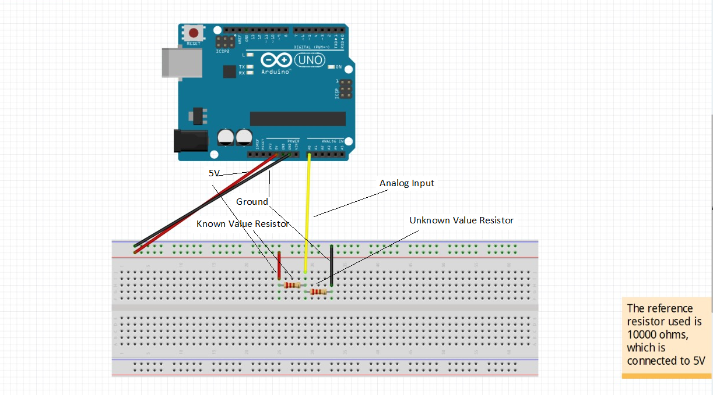

# Resistance-check

The system is designed to do a parallel resistance check.

## Components

1. Arduino-Uno
2. Resistor Board
3. Cables
4. Unknown Value Resistors
5. 1k, 10k, 100k ohm Resistors

## Design Approach

- The resitors are connected on the resistor board.
- The cables will be used to connect the resistors with the arduino.

We used:
1. the red cable to connect the 5v to the resistor with the known value.
2. the green cable is the ground and connected to the resistor whose value we want to find.
3. the yellow cable (analog input) is connected to the other ends of both resistors.

## Implementation
1. We made the connections like the image below.
2. Then we used a cable to connect the embedded system with the computer.
3. Then we run the code on the Arduino IDE.
4. The results will be displayed

## Expected Solution
Display values of the resistors.
